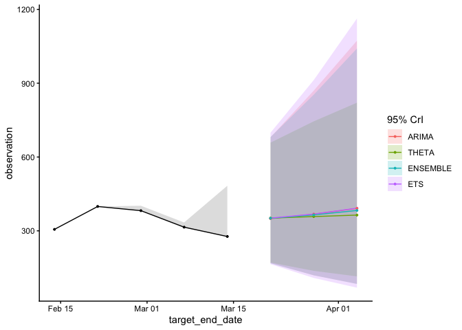

<!-- README.md is generated from README.Rmd. Please edit that file -->

# acciddasuite <a href="https://accidda.github.io/acciddasuite/"></a>

<!-- badges: start -->

<!-- badges: end -->

`acciddasuite` provides a simple pipeline for infectious diseases
forecasts. It validates input data (`check_data()`), optionally applies
nowcasting to adjust for reporting delays (`get_ncast()`), and generates
forecasts (`get_fcast()`).

## Installation

You can install the development version of acciddasuite from
[GitHub](https://github.com/) with:

``` r
# install.packages("pak")
#pak::pak("ACCIDDA/acciddasuite")
```

## Example

``` r
library(acciddasuite)
head(example_data)
#> # A tibble: 6 × 5
#>   as_of      location target            target_end_date observation
#>   <date>     <chr>    <chr>             <date>                <dbl>
#> 1 2024-11-17 NY       wk inc covid hosp 2020-08-08              517
#> 2 2024-11-24 NY       wk inc covid hosp 2020-08-08              517
#> 3 2024-12-01 NY       wk inc covid hosp 2020-08-08              517
#> 4 2024-12-08 NY       wk inc covid hosp 2020-08-08              517
#> 5 2024-12-15 NY       wk inc covid hosp 2020-08-08              517
#> 6 2024-12-22 NY       wk inc covid hosp 2020-08-08              517
```

``` r
fcast <- example_data |>
  check_data() |> 
  get_ncast() |> 
  get_fcast(
    eval_start_date = max(example_data$target_end_date) - 28,
    h = 3 # forecast 3 weeks into the future
  )
#> ℹ Using max_delay = 12 from data
#> ℹ Truncating from max_delay = 12 to 4.
```

``` r
fcast$plot
```



Save to [myRespiLens](https://www.respilens.com/myrespilens) format:

``` r
to_respilens(fcast, path = "respilens.json")
```
