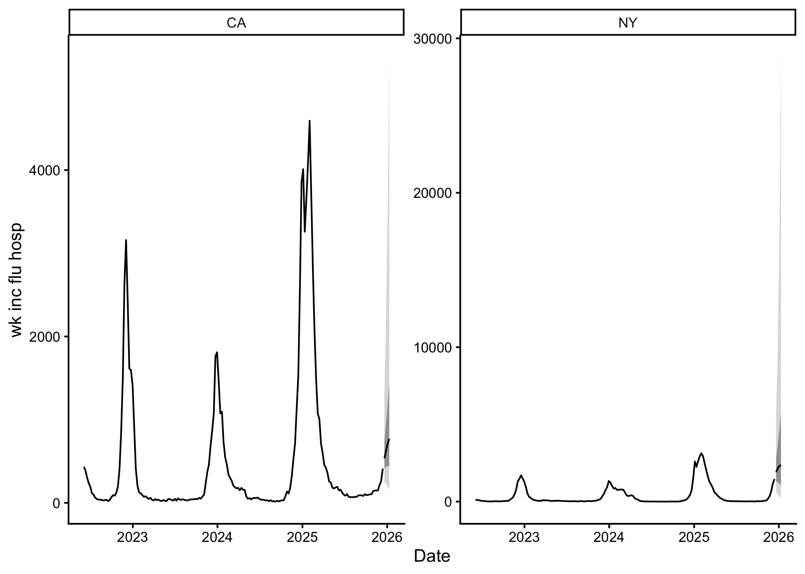

<!-- README.md is generated from README.Rmd. Please edit that file -->

# incast <a href="https://accidda.github.io/incast/"></a>

<!-- badges: start -->

<!-- badges: end -->

`incast` is an R package for infectious disease nowcasting and
forecasting developed as part of **[Insight
Net](https://www.cdc.gov/insight-net)**, a **[CDC Center for Forecasting
and Outbreak
Analytics](https://www.cdc.gov/forecast-outbreak-analytics/index.html)**
initiative. It provides a unified framework for generating, evaluating,
and operationalising infectious disease forecasts.

It fetches (`get_data()`) and validates input data (`check_data()`),
optionally applies nowcasting to adjust for reporting delays
(`get_ncast()`), evaluates models by cross-validation (`get_cv()`), and
generates forecasts (`get_fcast()`).

## Installation

You can install the development version of incast from
[GitHub](https://github.com/) with:

``` r
# install.packages("pak")
pak::pak("ACCIDDA/incast")
```

## Quick start

``` r
library(incast)
tail(example_data)
#> # A tibble: 6 × 5
#>   as_of      location target          target_end_date observation
#>   <date>     <chr>    <chr>           <date>                <dbl>
#> 1 2025-12-07 CA       wk inc flu hosp 2025-12-06              233
#> 2 2025-12-14 CA       wk inc flu hosp 2025-12-06              259
#> 3 2025-12-07 NY       wk inc flu hosp 2025-12-06             1160
#> 4 2025-12-14 NY       wk inc flu hosp 2025-12-06             1171
#> 5 2025-12-14 CA       wk inc flu hosp 2025-12-13              412
#> 6 2025-12-14 NY       wk inc flu hosp 2025-12-13             1462
```

``` r
fcast <- example_data |>
  check_data() |>
  get_ncast() |>
  get_cv(eval_start_date = as.Date("2024-10-01")) |>
  get_fcast()
#> ℹ Using max_delay = 6 from data
#> ℹ Truncating from max_delay = 6 to 2.
#> ℹ Using max_delay = 6 from data
#> ℹ Truncating from max_delay = 6 to 2.
#> [2026-07-31 12:37:37.015] get_cv: +3.4740 secs
#> [2026-07-31 12:37:40.503] get_fcast: +4.8977 secs

fcast
#> <incast_fcast>
#> Target:   wk inc flu hosp
#> Series:   2 (location)
#> Forecast: 2025-12-20 to 2026-01-10 (h = 4)
#> Models:   3 + ENSEMBLE

fcast |> autoplot()
```



Save to [myRespiLens](https://www.respilens.com/myrespilens) format:

``` r
to_respilens(fcast, path = "respilens.json")
```

## Citation

If you use `incast` in your work, please cite the package as follows:

``` r
citation("incast")
#> To cite package 'incast' in publications use:
#> 
#>   Geismar C (2026). _incast: A suite of tools for epidemic
#>   forecasting_. R package version 0.0.1,
#>   <https://github.com/ACCIDDA/incast>.
#> 
#> A BibTeX entry for LaTeX users is
#> 
#>   @Manual{,
#>     title = {incast: A suite of tools for epidemic forecasting},
#>     author = {Cyril Geismar},
#>     year = {2026},
#>     note = {R package version 0.0.1},
#>     url = {https://github.com/ACCIDDA/incast},
#>   }
```

## Acknowledgements

The package relies on the
[`baselinenowcast`](https://baselinenowcast.epinowcast.org/) and
[`fable`](https://fable.tidyverts.org/) framework for time series
nowcasting and forecasting. It produces forecasts in the
[`hubverse`](https://hubverse.io/) format for submission to the [CDC
Forecast
Hubs](https://www.cdc.gov/cfa-modeling-and-forecasting/about/index.html).
