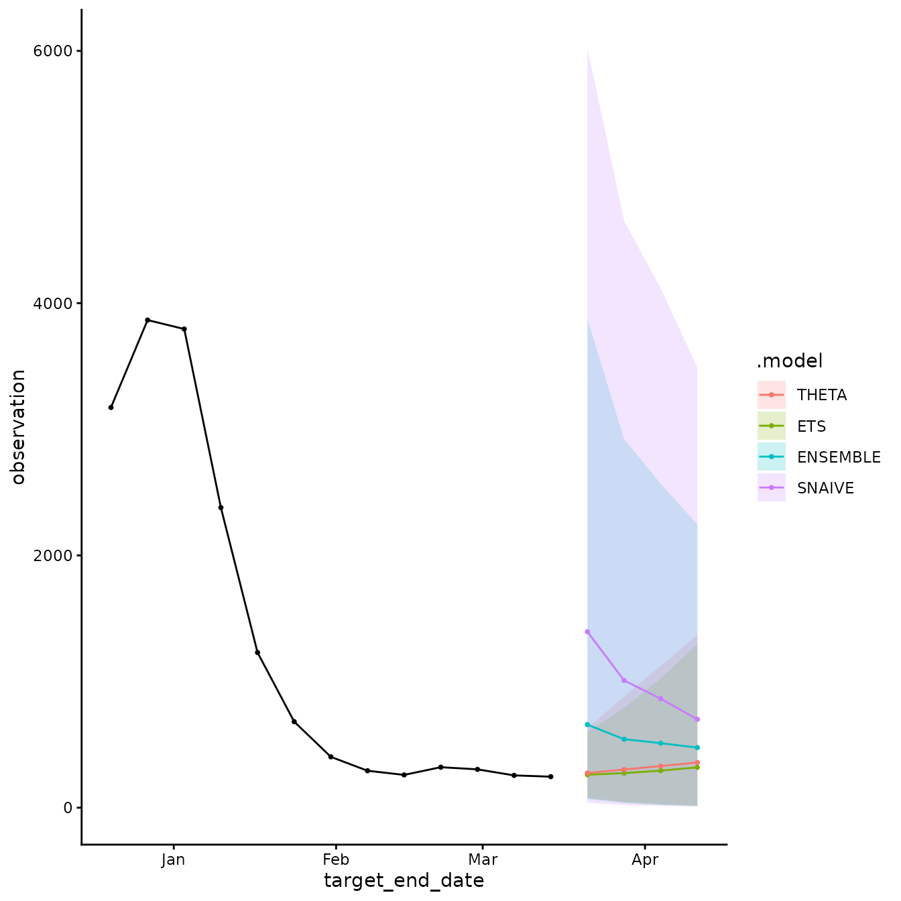

# acciddasuite

## Introduction

The `acciddasuite` package provides tools for building infectious
disease forecasts and relies on the
[`fable`](https://fable.tidyverts.org/) modeling framework. The overall
goal is to provide public health professionals with an easily-adoptable
approach to generating an ensemble of outputs from statistical models,
evaluating forecasts, and visualizing outputs.

This vignette demonstrates a basic example of generating, evaluating,
and visualizing forecasts following the standard forecasting workflow
described by [Hyndman & Athanasopoulos
(2021)](https://otexts.com/fpp3/basic-steps.html).

Updated forecasting package information can be found
[here](https://robjhyndman.com/hyndsight/forecast9.html).

## Forecasting Workflow

### `Forecast Planning`

**To get more information about how to know whether forecasting is the
best approach for your task, follow the steps in
[this](https://accidda.github.io/acciddasuite/articles/forecast_planning.md)
article.**

### `Time Series Data`

The first step of generating disease forecasts is providing time
series/surveillance data; the data that the mdoel will assume has
already happened.

**If you would like to load your own surveillance, you can follow
[these](https://accidda.github.io/acciddasuite/articles/external_data.md)
steps for formatting.**

For demonstration purposes, we will load surveillance data from the [CDC
National Health Safety
Network](https://data.cdc.gov/Public-Health-Surveillance/Weekly-Hospital-Respiratory-Data-HRD-Metrics-by-Ju/mpgq-jmmr/about_data)using
`acciddasuite`’s
[`get_data()`](https://accidda.github.io/acciddasuite/reference/get_data.md)
function. The data dictionary is available
[here](https://dev.socrata.com/foundry/data.cdc.gov/mpgq-jmmr).

The
[`get_data()`](https://accidda.github.io/acciddasuite/reference/get_data.md)
function provides a convenient interface to access this data using the
[`epidatr`](https://cmu-delphi.github.io/epidatr/) package.

``` r
library(dplyr)
library(ggplot2)
library(pipetime)
library(acciddasuite)
df <- get_data(pathogen = "covid", geo_values = "nc")
head(df)
#> # A tibble: 6 × 5
#>   as_of      location target            target_end_date observation
#>   <date>     <chr>    <chr>             <date>                <dbl>
#> 1 2026-03-15 NC       wk inc covid hosp 2020-08-08             1008
#> 2 2026-03-15 NC       wk inc covid hosp 2020-08-15              782
#> 3 2026-03-15 NC       wk inc covid hosp 2020-08-22             1150
#> 4 2026-03-15 NC       wk inc covid hosp 2020-08-29             2055
#> 5 2026-03-15 NC       wk inc covid hosp 2020-09-05             1762
#> 6 2026-03-15 NC       wk inc covid hosp 2020-09-12              941

df <- get_data(pathogen = "flu", geo_values = "ny")

head(df)
#> # A tibble: 6 × 5
#>   as_of      location target          target_end_date observation
#>   <date>     <chr>    <chr>           <date>                <dbl>
#> 1 2026-03-15 NY       wk inc flu hosp 2020-08-08                0
#> 2 2026-03-15 NY       wk inc flu hosp 2020-08-15                0
#> 3 2026-03-15 NY       wk inc flu hosp 2020-08-22                0
#> 4 2026-03-15 NY       wk inc flu hosp 2020-08-29                0
#> 5 2026-03-15 NY       wk inc flu hosp 2020-09-05                0
#> 6 2026-03-15 NY       wk inc flu hosp 2020-09-12                0
```

To examine `df` in more detail, you can access the example `csv` file
here:
[example_data.csv](https://github.com/ACCIDDA/acciddasuite/blob/main/example_data.csv).

### Time Series Cross-Validation

To evaluate model performance, we employ *time series cross-validation*.
We fit models using the data available up to a specific cutoff point
(`eval_start_date`), then forecast `h` weeks ahead with expanding
windows. The further back in time `eval_start_date` is, the more
computationally intensive the evaluation step will be.

We visualize the data and decide on the `eval_start_date`.

``` r
# We only evaluate on the last 90 days of data for demonstration purposes
eval_start_date <- max(df$target_end_date) - 90
```

Default models are:

- `SNAIVE` (Seasonal Naïve): Assumes this week will look like the same
  week last year. The simplest possible baseline.

- `ETS` (Exponential Smoothing): A weighted average where recent weeks
  matter more than older ones. Adapts to trends and seasonal patterns.

- `THETA`: Splits the data into a long-term trend and short-term
  fluctuations, forecasts each separately, then combines them.

- `ARIMA`: Learns repeating patterns from past values to predict future
  ones. Auto-configured to find the best fit.

``` r
fcast = get_fcast(
  df,
  eval_start_date = eval_start_date,
  top_n = 4, # Select top 4 models
  h = 4 # forecast 4 weeks ahead
) |>
  time_pipe("base fcast", log = "timing")

fcast
#> <accidda_cast>
#> 
#> Models evaluated:
#>  model_id       wis
#>    <char>     <num>
#>     THETA  641.3733
#>       ETS  688.2211
#>  ENSEMBLE  689.7293
#>    SNAIVE 1036.9490
#> 
#> Forecast horizon:
#>   From: 2025-12-20 
#>   To:   2026-04-11 
#> 
#> Contents:
#>   $hubcast   hub forecast object
#>   $score     model ranking table
#>   $plot      ggplot2 object
```

Visualize forecasts by accessing the `plot` element of the forecast
object:

``` r
fcast$plot
```



View forecast evaluation by viewing the `score` element of the object:

``` r
fcast$score
#> Key: <model_id>
#>    model_id       wis interval_coverage_50 interval_coverage_95
#>      <char>     <num>                <num>                <num>
#> 1:    THETA  641.3733            0.4166667            0.7500000
#> 2:      ETS  688.2211            0.2500000            0.6666667
#> 3: ENSEMBLE  689.7293            0.5000000            0.8333333
#> 4:   SNAIVE 1036.9490            0.1666667            0.9166667
#>    wis_relative_skill
#>                 <num>
#> 1:          0.8556421
#> 2:          0.9181408
#> 3:          0.9201528
#> 4:          1.3833710
```

### Adding `extra_models`

Additional models can be added by defining them in a list and passing
them to
[`get_fcast()`](https://accidda.github.io/acciddasuite/reference/get_fcast.md).
The models should be compatible with the fable framework (see [fable
documentation](https://fabletools.tidyverts.org/articles/extension_models.html)
for more information).

``` r
library(fable)
library(fable.prophet)
extra <- list(
  CUSTOM_ARIMA = ARIMA(observation ~ pdq(1,1,0)),
  PROPHET = prophet(observation ~ season("year")),
  EPIESTIM = EPIESTIM(observation, mean_si = 3, std_si = 2, rt_window = 7)
)

fcast = get_fcast(
  df,
  eval_start_date = eval_start_date,
  top_n = 4, # Select top 4 models
  h = 3, # forecast 3 weeks ahead,
  extra_models = extra
) |>
  time_pipe("extra fcast", log = "timing")
```

You can check how long each step took by calling
[`pipetime::get_log()`](https://rdrr.io/pkg/pipetime/man/get_log.html):

``` r
get_log()
#> $timing
#>             timestamp       label duration unit
#> 1 2026-03-20 19:21:27  base fcast 10.16703 secs
#> 2 2026-03-20 19:21:38 extra fcast 22.30154 secs
```

## Submit to MyRespiLens

[RespiLens](https://www.respilens.com/) is a platform for sharing and
visualizing respiratory disease forecasts. To submit forecasts to
RespiLens, you can use
[`to_respilens()`](https://accidda.github.io/acciddasuite/reference/to_respilens.md)
to save the file in JSON format and upload it to MyRespiLens
[here](https://www.respilens.com/myrespilens).

``` r
to_respilens(fcast, "respilens.json")
```
