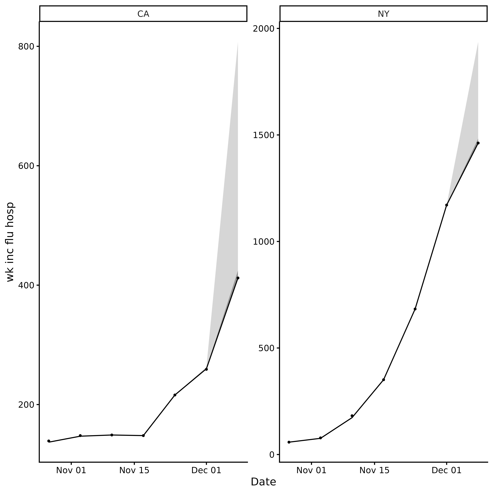
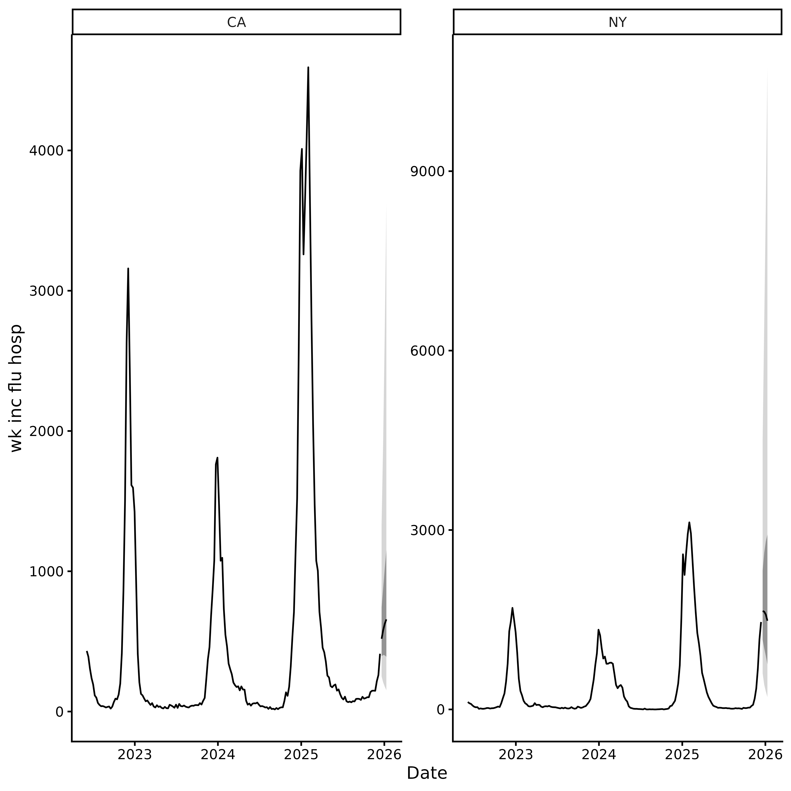

# acciddasuite

## Overview

`acciddasuite` builds infectious disease forecasts in a few steps:

1.  **[`get_data()`](https://accidda.github.io/acciddasuite/reference/get_data.md)**
    or
    **[`check_data()`](https://accidda.github.io/acciddasuite/reference/check_data.md)**:
    fetch or validate surveillance data.
2.  **[`get_ncast()`](https://accidda.github.io/acciddasuite/reference/get_ncast.md)**
    *(optional)*: correct recent weeks for reporting delays.
3.  **[`get_cv()`](https://accidda.github.io/acciddasuite/reference/get_cv.md)**
    *(optional)*: evaluate candidate models by time series
    cross-validation.
4.  **[`get_fcast()`](https://accidda.github.io/acciddasuite/reference/get_fcast.md)**:
    ensemble the best models into a forward-looking forecast.

The package relies on the [`fable`](https://fable.tidyverts.org/)
modeling framework and follows the standard forecasting workflow
described by [Hyndman & Athanasopoulos
(2021)](https://otexts.com/fpp3/basic-steps.html). The overall goal is
to provide public health professionals with an easily-adoptable approach
to generating, evaluating forecasts, and visualizing infectious disease
forecasts.

To get more information about how to know whether forecasting is the
best approach for your task, follow the steps in
[this](https://accidda.github.io/acciddasuite/articles/forecast_planning.md)
article.

``` r

library(acciddasuite)
```

## Step 1: Get data

We fetch weekly COVID-19 hospital admissions for New York from the [CDC
NHSN](https://data.cdc.gov/Public-Health-Surveillance/Weekly-Hospital-Respiratory-Data-HRD-Metrics-by-Ju/mpgq-jmmr/about_data)
via [`epidatr`](https://cmu-delphi.github.io/epidatr/).

Setting `revisions = TRUE` retrieves the full revision history (*i.e.*
all past versions of the data), which is needed for nowcasting.

``` r

df <- get_data(pathogen = "covid", geo_value = c("ny", "ca"), revisions = TRUE)
```

You can also provide **your own data**. Just pass it through
[`check_data()`](https://accidda.github.io/acciddasuite/reference/check_data.md).
See
[`vignette("external_data")`](https://accidda.github.io/acciddasuite/articles/external_data.md)
for formatting details.

``` r

tail(example_data)
#> # A tibble: 6 × 5
#>   as_of      location target          target_end_date observation
#>   <date>     <chr>    <chr>           <date>                <dbl>
#> 1 2025-12-07 CA       wk inc flu hosp 2025-12-06              233
#> 2 2025-12-14 CA       wk inc flu hosp 2025-12-06              259
#> 3 2025-12-07 NY       wk inc flu hosp 2025-12-06             1160
#> 4 2025-12-14 NY       wk inc flu hosp 2025-12-06             1171
#> 5 2025-12-14 CA       wk inc flu hosp 2025-12-13              412
#> 6 2025-12-14 NY       wk inc flu hosp 2025-12-13             1462
df <- check_data(example_data)
autoplot(df)
```


## Step 2: Nowcasting (optional)

The most recent weeks of surveillance data are almost always too low
because hospitals are still filing late reports (**right truncated**).
If you feed these raw counts into a forecaster, predictions will be
biased downward.

[`get_ncast()`](https://accidda.github.io/acciddasuite/reference/get_ncast.md)
estimates what the recent counts will look like once all reports arrive.
With the default `max_delay = 2`, the last 2 weeks are corrected;
everything before that is left untouched.

``` r

ncast <- get_ncast(df)
ncast
#> <accidda_ncast>
#> Target:   wk inc flu hosp
#> Series:   2 (location)
#> Window:   2022-06-04 to 2025-12-13 (7-day interval)
#> Nowcast:  2025-12-06 to 2025-12-13
autoplot(ncast)
```



The corrected `ncast$data` contains two extra columns: `ncast_lower` and
`ncast_upper` (95% CrI) for the corrected weeks.
[`get_fcast()`](https://accidda.github.io/acciddasuite/reference/get_fcast.md)
detects these automatically and uses them to propagate nowcasting
uncertainty into the final forecast.

## Step 3: Forecasting

Forecasting is split into two steps:

1.  **[`get_cv()`](https://accidda.github.io/acciddasuite/reference/get_cv.md)
    (model selection)**: time series cross-validation on the full
    (median corrected) series, starting from `eval_start_date`. Models
    are ranked by WIS and interval coverage.
2.  **[`get_fcast()`](https://accidda.github.io/acciddasuite/reference/get_fcast.md)
    (final forecast)**: reuses the ranking to ensemble the best `top_n`
    models and projects `h` weeks into the future. When nowcast columns
    are present, the forecast is produced from three baselines (lower,
    median, and upper nowcast estimates) and pooled, so prediction
    intervals reflect both model uncertainty and nowcast uncertainty.

We set `eval_start_date` to mark the start of the evaluation window. All
observations before this date form the initial training window, so every
series needs at least two observations before it.

Default models are:

- `NAIVE`: Carries the last observed value forward. The simplest
  possible baseline.

- `ETS` (Exponential Smoothing): A weighted average where recent weeks
  matter more than older ones. Adapts to trends and seasonal patterns.

- `THETA`: Splits the data into a long-term trend and short-term
  fluctuations, forecasts each separately, then combines them.

- `ARIMA`: Learns repeating patterns from past values to predict future
  ones. Auto-configured to find the best fit.

``` r

eval_start_date <- as.Date("2024-01-10")
cv <- get_cv(ncast, eval_start_date)
cv
#> <accidda_cv>
#> Target:   wk inc flu hosp
#> Series:   2 (location)
#> Window:   2022-06-04 to 2025-12-13 (7-day interval)
#> CV:       4 models x 25 origins (h = 4)
```

You can plot the relative WIS for each model and location with
[`autoplot()`](https://ggplot2.tidyverse.org/reference/autoplot.html). A
value of `wis_relative_skill`=1 indicates average performance, values
below 1 indicate lower WIS (better forecasts), and values above 1
indicate higher WIS (worse forecasts).

``` r

autoplot(cv) +
  ggplot2::scale_x_log10()
```


``` r

fcast <- get_fcast(cv, top_n = 2)
fcast
#> <accidda_fcast>
#> Target:   wk inc flu hosp
#> Series:   2 (location)
#> Forecast: 2025-12-20 to 2026-01-10 (h = 4)
#> Models:   2 + ENSEMBLE
```

Plot the ensemble forecast with `autoplot(fcast)` (pass `model =` to
inspect any single model instead):

``` r

autoplot(fcast)
```



### Adding custom models

Any model compatible with the [`fable`](https://fable.tidyverts.org/)
framework can be passed to
[`get_cv()`](https://accidda.github.io/acciddasuite/reference/get_cv.md)
via `models`. Compose with
[`default_models()`](https://accidda.github.io/acciddasuite/reference/default_models.md)
to keep the built-ins alongside your own:

``` r

library(fable)
library(fable.prophet)
library(EpiEstim)
library(projections)
my_models <- c(
  default_models(),
  list(
    CUSTOM_ARIMA = ARIMA(observation ~ pdq(1, 1, 0)),
    PROPHET = prophet(observation ~ season("year")),
    NNETAR = NNETAR(observation),
    EPIESTIM = EPIESTIM(observation, mean_si = 3, std_si = 2, rt_window = 7),
    CHRONOS = FOUNDATION(log(observation), "chronos"),
    TIMESFM = FOUNDATION(log(observation), "timesfm")
  )
)

cv <- get_cv(
  ncast,
  eval_start_date = eval_start_date,
  models = my_models
)

fcast <- get_fcast(cv, top_n = 3)
```

## Submit to RespiLens

[RespiLens](https://www.respilens.com/) is a platform for sharing
respiratory disease forecasts. Use
[`to_respilens()`](https://accidda.github.io/acciddasuite/reference/to_respilens.md)
to export the forecast as JSON for upload to
[MyRespiLens](https://www.respilens.com/myrespilens).

``` r

to_respilens(fcast, "respilens.json")
```
