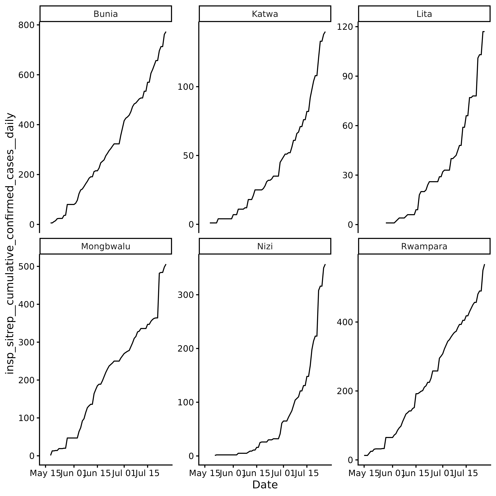
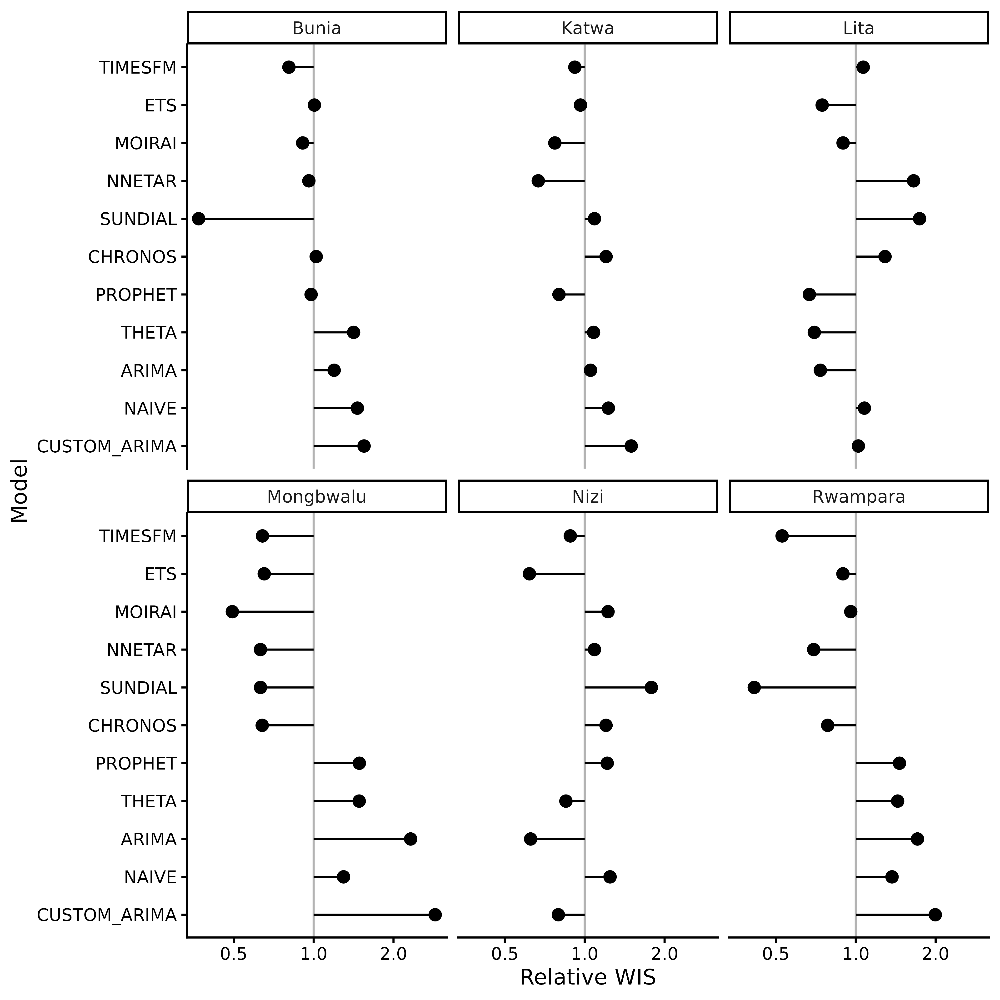
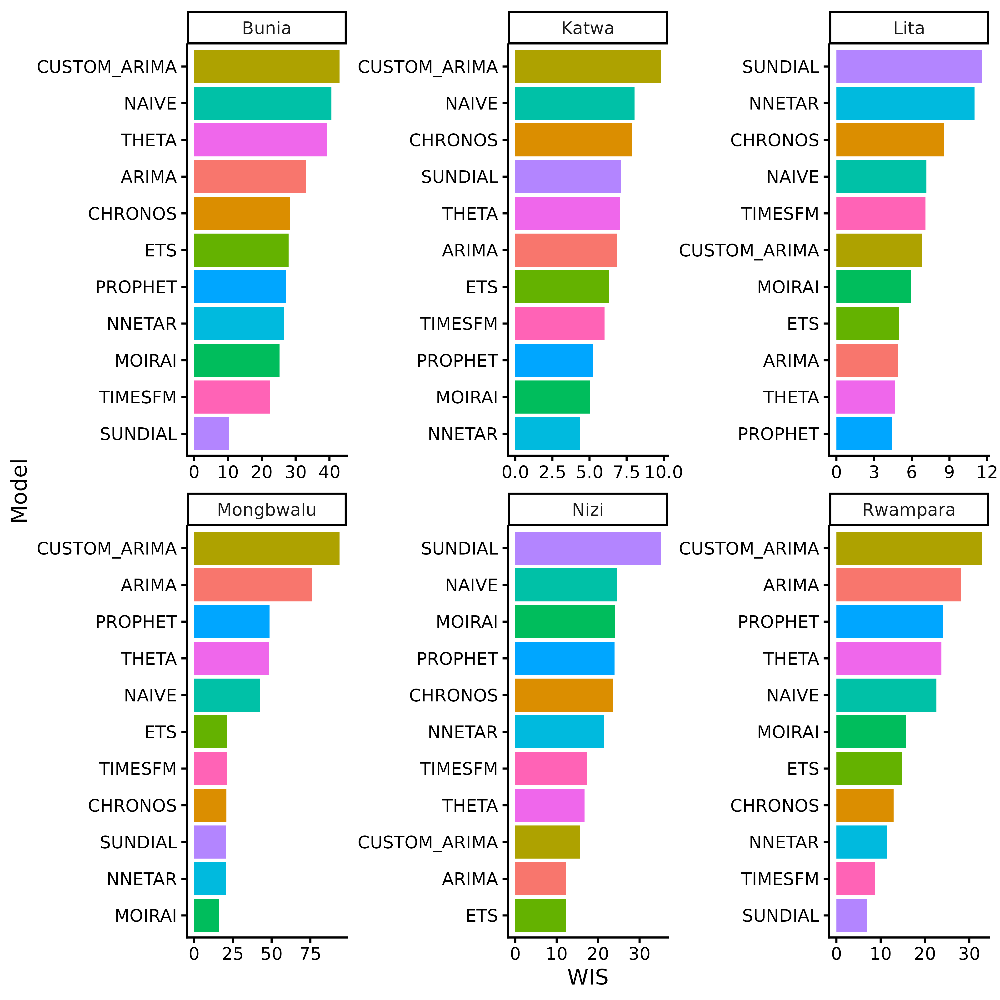
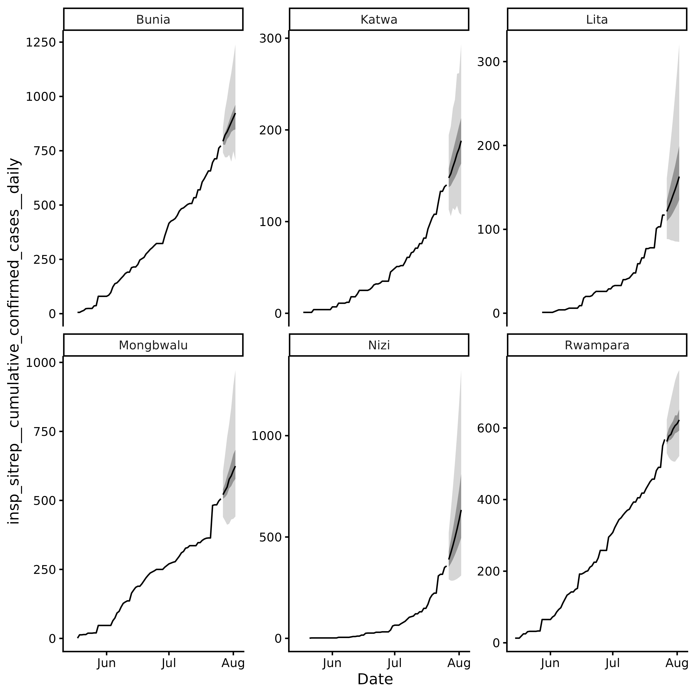
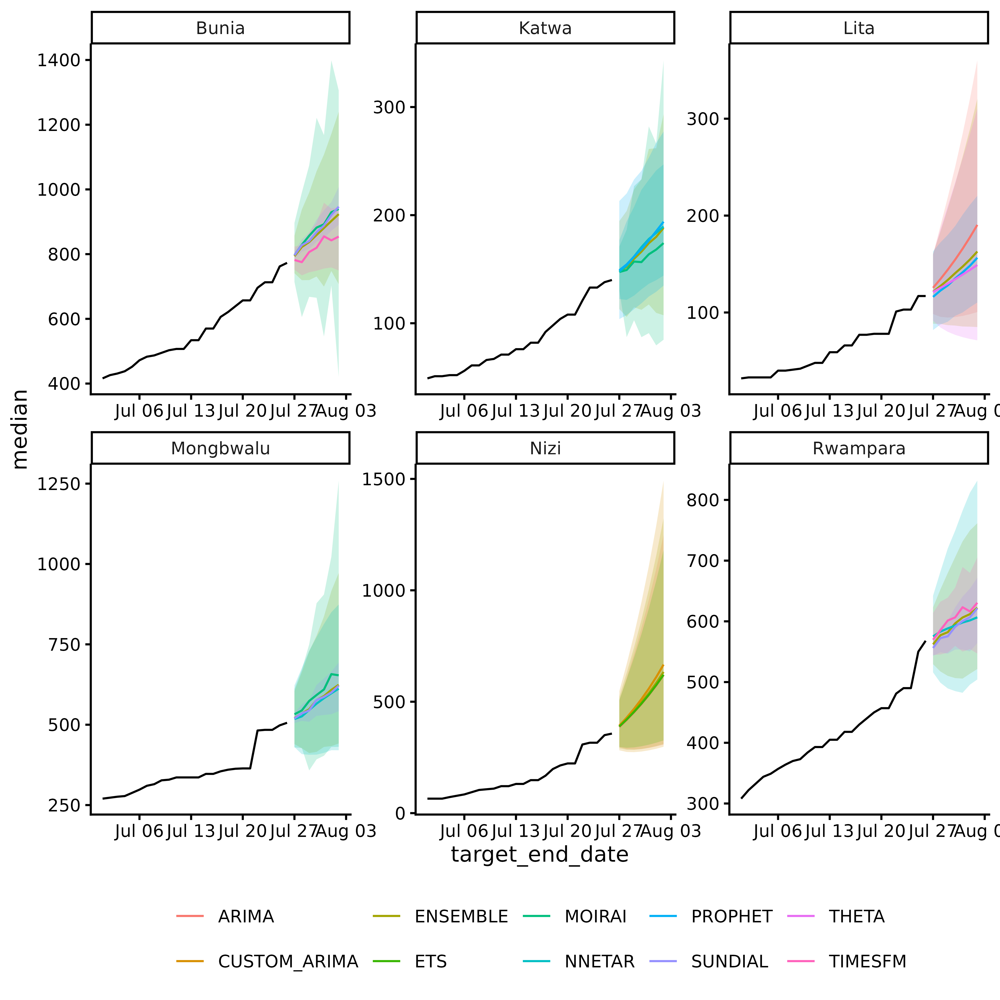

# Ebola 2026

## Overview

In May 2026, the Democratic Republic of the Congo (DRC) reported an
Ebola outbreak caused by the Bundibugyo strain, five months after the
previous epidemic. By July 2026, 2,423 cases and 967 deaths had been
reported. Rapid forecasting is critical for guiding public health
response and resource allocation. This vignette demonstrates how to use
`incast` to forecast Ebola incidence using surveillance data from the
[Institut National de Recherche Biomédicale
(INRB)](https://github.com/INRB-UMIE/BDBV2026-Data).

The vignette is not executed because the models are computationally
expensive. Running the code locally may take several minutes.

## Data

We model the six locations with the highest cumulative confirmed cases.
For each location, we create a daily time series up to the latest
reporting date, filling missing days by carrying forward cumulative
counts and removing downward corrections. Leading zeros before the first
reported case are removed because the models use log-transformed
incidence; locations with later introductions therefore have shorter
time series.

``` r

library(dplyr)
library(tidyr)
library(ggplot2)

ebola <- read.csv(
  "https://raw.githubusercontent.com/scc-usc/ebola2026/refs/heads/main/hubverse_observed_data.csv"
) |>
  filter(
    target == "insp_sitrep__cumulative_confirmed_cases__daily",
    !is.na(location)
  ) |>
  mutate(target_end_date = as.Date(target_end_date))

top_locations <- ebola |>
  slice_max(target_end_date, by = location) |>
  slice_max(observation, n = 6) |>
  pull(location)

ebola <- ebola |>
  filter(location %in% top_locations) |>
  arrange(location, target_end_date) |>
  group_by(location) |>
  complete(
    target_end_date = seq(
      min(target_end_date),
      max(target_end_date),
      by = "day"
    )
  ) |>
  fill(observation, .direction = "down") |> # carry cumulative over gaps
  mutate(observation = cummax(coalesce(observation, 0))) |> # monotonic, per location
  filter(cumsum(observation > 0) > 0) |> # drop pre-first-case zeros; log() needs > 0
  ungroup() |>
  mutate(target = "insp_sitrep__cumulative_confirmed_cases__daily")
```

## `incast` Workflow

### Data Validation

[`check_data()`](https://accidda.github.io/incast/reference/check_data.md)
validates the Ebola data and returns an `incast_data` object. The
function checks for missing values, ensures that the data is in the
correct format, and verifies that the necessary columns are present.

``` r

library(incast)
data <- ebola |> check_data()
```

``` r

data
#> <incast_data>
#> Target:   insp_sitrep__cumulative_confirmed_cases__daily
#> Series:   6 (location)
#> Window:   2026-05-15 to 2026-07-26 (1-day interval)
data |> autoplot()
```



Revised history of cumulative confirmed cases is not available for this
outbreak, so we will skip
[`get_ncast()`](https://accidda.github.io/incast/reference/get_ncast.md)
and proceed directly to cross-validation and forecasting.

### Cross Validation

[`get_cv()`](https://accidda.github.io/incast/reference/get_cv.md)
performs rolling-origin time series cross-validation and returns an
`incast_cv` object containing the results for each model and location.

First we define a list of models to test. We will use the default models
provided by `incast` from `fable` and add some custom models, including
ARIMA, a neural network, and several foundation models.

``` r

library(fable)
library(fable.prophet)

models <- c(
  default_models(),
  list(
    CUSTOM_ARIMA = ARIMA(log(observation) ~ pdq(1, 1, 0)),
    NNETAR = NNETAR(log(observation), n_networks = 10),
    PROPHET = prophet(log(observation)),
    # you will need a python environment (see reticulate)
    CHRONOS = FOUNDATION(log(observation), "chronos"),
    TIMESFM = FOUNDATION(log(observation), "timesfm"),
    SUNDIAL = FOUNDATION(log(observation), "sundial"),
    MOIRAI = FOUNDATION(log(observation), "moirai")
  )
)
```

Here we forecast 7 days ahead with 16 origins spaced 1 day apart, so the
evaluation period spans 22 days.

``` r

cv <- data |>
  get_cv(
    h = 7, # forecast horizon
    step = 1, # one origin per day
    n_origins = 16,
    models = models
  )
```

``` r

cv
#> <incast_cv>
#> Target:   insp_sitrep__cumulative_confirmed_cases__daily
#> Series:   6 (location)
#> Window:   2026-05-15 to 2026-07-26 (1-day interval)
#> CV:       11 models x 16 origins (h = 7)
cv |>
  autoplot() +
  ggplot2::scale_x_continuous(transform = "log2")
```



[`autoplot()`](https://ggplot2.tidyverse.org/reference/autoplot.html)
summarises cross-validation performance using relative WIS
(`wis_relative_skill` in `cv$score`). Raw WIS depends on the scale of
the observed data and is therefore not directly comparable across
locations. Relative WIS normalises scores within each location, allowing
performance to be compared across locations.

The log scale makes relative differences easier to interpret: values of
0.5 and 2 indicate half and double the reference WIS, respectively, and
are equally distant from the reference value of 1 on the log scale.

You can also build your own summaries from `cv$score`. For example, raw
WIS per model and location.

``` r

cv$score |>
  group_by(location) |>
  arrange(wis, .by_group = TRUE) |>
  mutate(model_id_ordered = paste(model_id, location, sep = "__")) |>
  ggplot(aes(y = reorder(model_id_ordered, wis), x = wis)) +
  facet_wrap(~location, scales = "free") +
  geom_col(aes(fill = model_id), show.legend = FALSE) +
  scale_y_discrete(labels = \(x) sub("__.*$", "", x)) +
  theme_classic() +
  labs(y = "Model", x = "WIS")
```



### Forecasting

By default
[`get_fcast()`](https://accidda.github.io/incast/reference/get_fcast.md)
will use the best 3 model for each location based on the
cross-validation results. The function returns a `incast_fcast` object
containing the forecasts for each location.

``` r

fcast <- cv |> get_fcast()
```

``` r

fcast
#> <incast_fcast>
#> Target:   insp_sitrep__cumulative_confirmed_cases__daily
#> Series:   6 (location)
#> Forecast: 2026-07-27 to 2026-08-02 (h = 7)
#> Models:   9 + ENSEMBLE
fcast$meta$selection
#> # A tibble: 18 × 2
#>    location  model_id    
#>    <chr>     <chr>       
#>  1 Bunia     SUNDIAL     
#>  2 Bunia     TIMESFM     
#>  3 Bunia     MOIRAI      
#>  4 Katwa     NNETAR      
#>  5 Katwa     MOIRAI      
#>  6 Katwa     PROPHET     
#>  7 Lita      PROPHET     
#>  8 Lita      THETA       
#>  9 Lita      ARIMA       
#> 10 Mongbwalu MOIRAI      
#> 11 Mongbwalu NNETAR      
#> 12 Mongbwalu SUNDIAL     
#> 13 Nizi      ETS         
#> 14 Nizi      ARIMA       
#> 15 Nizi      CUSTOM_ARIMA
#> 16 Rwampara  SUNDIAL     
#> 17 Rwampara  TIMESFM     
#> 18 Rwampara  NNETAR
```

[`autoplot()`](https://ggplot2.tidyverse.org/reference/autoplot.html)
visualizes the ensemble forecasts for each location, including the
median, 50% and 95% prediction intervals.

``` r

fcast |> autoplot()
```



You can also build your own plot using
[`as_tibble()`](https://tibble.tidyverse.org/reference/as_tibble.html)
to extract the forecast data and `ggplot2` to create a custom
visualization.

``` r

fcast |>
  as_tibble() |>
  ggplot() +
  geom_ribbon(
    aes(x = target_end_date, ymin = lower, ymax = upper, fill = model_id),
    alpha = 0.2,
    show.legend = FALSE
  ) +
  geom_line(
    aes(x = target_end_date, y = median, colour = model_id),
    show.legend = TRUE
  ) +
  facet_wrap(~location, scales = "free") +
  # ground truth
  geom_line(
    data = fcast$hub$oracle_output |>
      filter(target_end_date >= as.Date("2026-07-01")),
    aes(x = target_end_date, y = oracle_value),
    color = "black"
  ) +
  theme_classic() +
  theme(
    legend.position = "bottom",
    legend.title = element_blank()
  )
```


