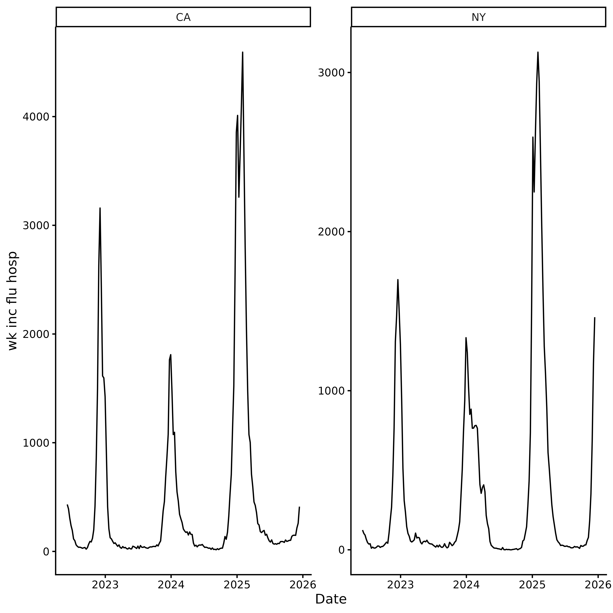
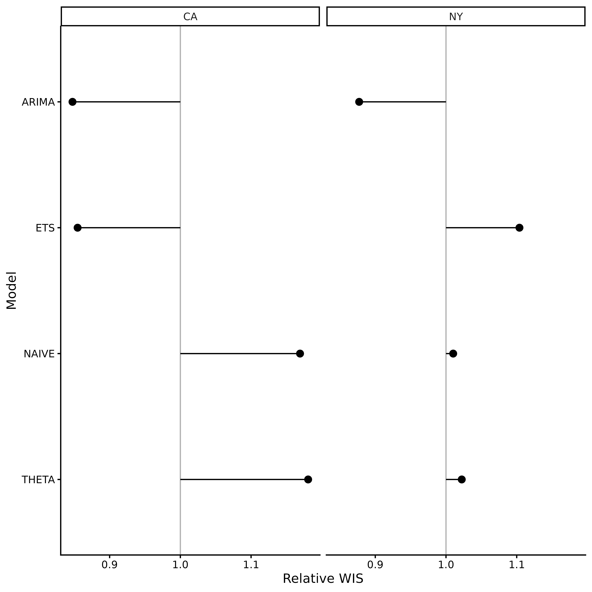
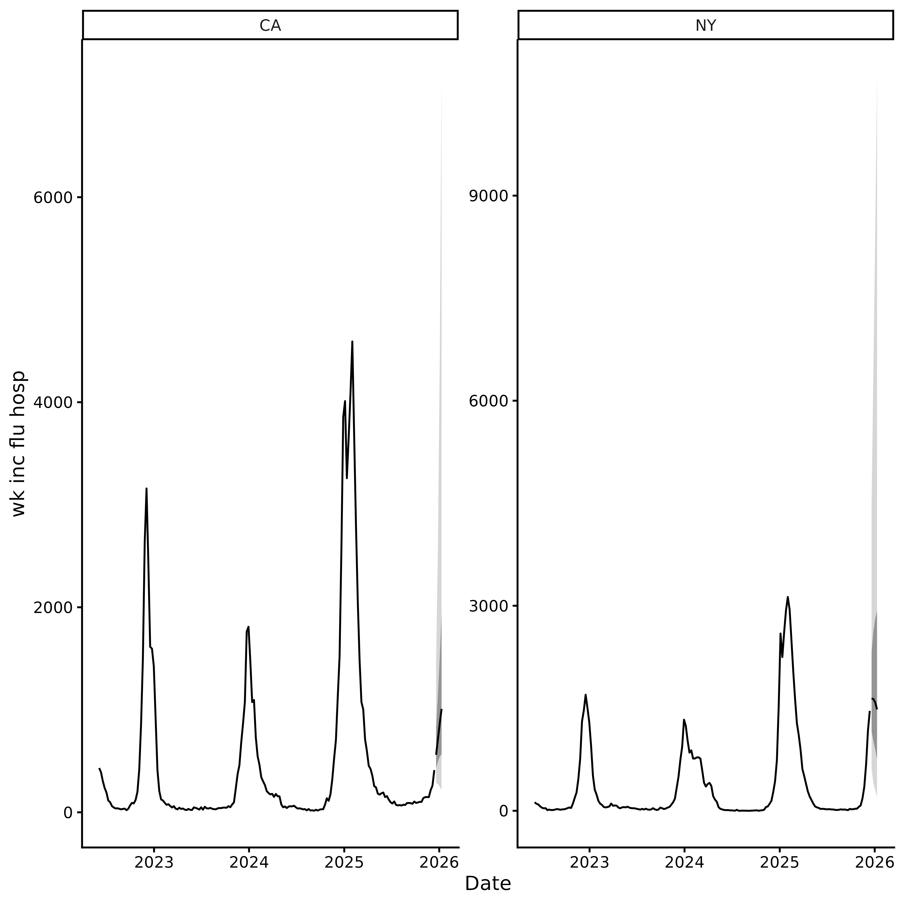

# incast

## Overview

`incast` builds infectious disease forecasts in a few steps:

1.  **[`get_data()`](https://accidda.github.io/incast/reference/get_data.md)**
    or
    **[`check_data()`](https://accidda.github.io/incast/reference/check_data.md)**:
    fetch or validate surveillance data.
2.  **[`get_ncast()`](https://accidda.github.io/incast/reference/get_ncast.md)**
    *(optional)*: correct recent weeks for reporting delays.
3.  **[`get_cv()`](https://accidda.github.io/incast/reference/get_cv.md)**
    *(optional)*: evaluate candidate models by time series
    cross-validation.
4.  **[`get_fcast()`](https://accidda.github.io/incast/reference/get_fcast.md)**:
    ensemble the best models into a forward-looking forecast.

The package follows the standard forecasting workflow described by
[Hyndman & Athanasopoulos
(2021)](https://otexts.com/fpp3/basic-steps.html). The overall goal is
to provide public health professionals with an easily-adoptable approach
to generating, evaluating forecasts, and visualising infectious disease
forecasts.

To get more information about how to know whether forecasting is the
best approach for your task, follow the steps in
[this](https://accidda.github.io/incast/articles/forecast_planning.md)
article.

``` r

library(incast)
```

## Step 1: Get data

We fetch weekly flu hospital admissions for New York and California from
the [CDC
NHSN](https://data.cdc.gov/Public-Health-Surveillance/Weekly-Hospital-Respiratory-Data-HRD-Metrics-by-Ju/mpgq-jmmr/about_data)
via [`epidatr`](https://cmu-delphi.github.io/epidatr/).

Setting `revisions = TRUE` retrieves the full revision history (*i.e.*
all past versions of the data), which is needed for nowcasting.

``` r

# You may need a Delphi API key to run this code.
# See `?epidatr::get_api_key()` for details.
df <- get_data(pathogen = "flu", geo_value = c("ny", "ca"), revisions = TRUE)
```

You can also provide **your own data**. Just pass it through
[`check_data()`](https://accidda.github.io/incast/reference/check_data.md).
See
[`vignette("external_data")`](https://accidda.github.io/incast/articles/external_data.md)
for formatting details.

``` r

tail(example_data)
#> # A tibble: 6 × 5
#>   as_of      location target          target_end_date observation
#>   <date>     <chr>    <chr>           <date>                <dbl>
#> 1 2025-12-07 CA       wk inc flu hosp 2025-12-06              233
#> 2 2025-12-14 CA       wk inc flu hosp 2025-12-06              259
#> 3 2025-12-07 NY       wk inc flu hosp 2025-12-06             1160
#> 4 2025-12-14 NY       wk inc flu hosp 2025-12-06             1171
#> 5 2025-12-14 CA       wk inc flu hosp 2025-12-13              412
#> 6 2025-12-14 NY       wk inc flu hosp 2025-12-13             1462
df <- check_data(example_data)
autoplot(df)
```



## Step 2: Nowcasting (optional)

The most recent weeks of surveillance data are almost always too low
because hospitals are still filing late reports (**right truncated**).
If you feed these raw counts into a forecaster, predictions will be
biased downward.

[`get_ncast()`](https://accidda.github.io/incast/reference/get_ncast.md)
estimates what the recent counts will look like once all reports arrive.
With the default `max_delay = 2`, the last 2 weeks are corrected;
everything before that is left untouched.

``` r

ncast <- get_ncast(df)
ncast
#> <incast_ncast>
#> Target:   wk inc flu hosp
#> Series:   2 (location)
#> Window:   2022-06-04 to 2025-12-13 (7-day interval)
#> Nowcast:  2025-12-06 to 2025-12-13
autoplot(ncast)
```


The corrected `ncast$data` contains two extra columns: `ncast_lower` and
`ncast_upper` (95% CrI) for the corrected weeks.
[`get_fcast()`](https://accidda.github.io/incast/reference/get_fcast.md)
detects these automatically and uses them to propagate nowcasting
uncertainty into the final forecast.

## Step 3: Forecasting

Forecasting is split into two steps:

1.  **[`get_cv()`](https://accidda.github.io/incast/reference/get_cv.md)
    (model selection)**: performs time series cross-validation on the
    full (median-corrected). Models are ranked by Weighted Interval
    Score (WIS).
2.  **[`get_fcast()`](https://accidda.github.io/incast/reference/get_fcast.md)
    (final forecast)**: ensembles the best `top_n` models and generates
    forecasts `h` weeks ahead. When nowcast columns are available,
    forecasts are generated from the lower, median, and upper nowcast
    estimates and pooled, so prediction intervals capture both model and
    nowcast uncertainty.

Default models are:

- `NAIVE`: Carries the last observed value forward. A simple baseline.

- `ETS` (Exponential Smoothing): A weighted average where recent weeks
  matter more than older ones. Adapts to trends and seasonal patterns.

- `THETA`: Splits the data into a long-term trend and short-term
  fluctuations, forecasts each separately, then combines them.

- `ARIMA`: Models temporal dependence in the series using autoregressive
  and moving average terms. Parameters are selected automatically.

### Cross Validation

[`get_cv()`](https://accidda.github.io/incast/reference/get_cv.md)
performs rolling-origin time series cross-validation. The time series is
split into two parts:

- **Training data**: all observations before `eval_start_date`, used to
  fit the models.
- **Evaluation period**: all observations from `eval_start_date` to the
  end of the series, used to score the forecasts.

``` text
|<--------- training data --------->|<---- evaluation period ---->|
start of series                 eval_start_date                   t
```

Three arguments determine how cross-validation is performed.

- **`h`**: the forecast horizon, that is, the number of reporting
  intervals to predict ahead.

- **`step`**: the spacing between forecast origins.

  - `step = h` (default) produces non-overlapping forecasts and is the
    fastest option.
  - `step < h` produces overlapping forecasts, resulting in more
    evaluation points but requiring more model fits.

- **`eval_start_date`**: the first forecast origin. You can specify it
  directly, or choose the number of forecast origins (`N`) and calculate
  it as:

``` text
eval_start_date = t - ((h - 1) + (N - 1) * step) * interval
```

where:

- `t` is the last observation date.
- `interval` is the reporting interval in days (for example, `1` for
  daily data or `7` for weekly data).

A forecast origin at time `d` predicts intervals `d` to `d + h - 1`.
Therefore, `N` forecast origins spaced `step` intervals apart span:

``` text
h + (N - 1) * step
```

reporting intervals in total.

For example, if `h = 4`, `step = 4`, and `N = 3`:

``` text
Forecast N1: [d,   d+1, d+2, d+3]
Forecast N2: [d+4, d+5, d+6, d+7]
Forecast N3: [d+8, d+9, d+10, d+11]
```

The evaluation period therefore spans `d` to `d+11` (12 intervals in
total).

Increasing `N` provides a more reliable comparison of models, but leaves
less historical data for training. Ensure that each time series contains
enough observations before `eval_start_date` to fit the models reliably.

The function returns an `incast_cv` object containing the
cross-validation results for each model and location.

``` r

h <- 4 # forecast horizon
step <- h # non-overlapping forecasts
N <- 16 # number of origins
t <- max(df$data$target_end_date) # last observation date
eval_start_date <- t - ((h - 1) + (N - 1) * step) * df$interval
cv <- get_cv(ncast, as.Date(eval_start_date), h)
cv
#> <incast_cv>
#> Target:   wk inc flu hosp
#> Series:   2 (location)
#> Window:   2022-06-04 to 2025-12-13 (7-day interval)
#> CV:       4 models x 16 origins (h = 4)
```

Plot relative WIS by model and location using
[`autoplot()`](https://ggplot2.tidyverse.org/reference/autoplot.html).
Values of `wis_relative_skill` below 1 indicate better-than-average
forecasts (lower WIS), while values above 1 indicate worse-than-average
forecasts (higher WIS).

``` r

autoplot(cv)
```



### Forecast

[`get_fcast()`](https://accidda.github.io/incast/reference/get_fcast.md)
ensembles the best `top_n` models from cross-validation and forecasts
`h` reporting intervals ahead. `h` defaults to the horizon used in
[`get_cv()`](https://accidda.github.io/incast/reference/get_cv.md).

``` r

fcast <- get_fcast(cv, top_n = 2)
fcast
#> <incast_fcast>
#> Target:   wk inc flu hosp
#> Series:   2 (location)
#> Forecast: 2025-12-20 to 2026-01-10 (h = 4)
#> Models:   3 + ENSEMBLE
```

Plot the ensemble forecast with `autoplot(fcast)` (pass `model =` to
inspect any single model instead):

``` r

autoplot(fcast)
```



### Adding custom models

Any model compatible with the [`fable`](https://fable.tidyverts.org/)
framework can be passed to
[`get_cv()`](https://accidda.github.io/incast/reference/get_cv.md)/[`get_fcast()`](https://accidda.github.io/incast/reference/get_fcast.md)
via `models`. Compose with
[`default_models()`](https://accidda.github.io/incast/reference/default_models.md)
to keep the built-ins alongside your own:

``` r

library(fable)
library(fable.prophet)
library(EpiEstim)
library(projections)
my_models <- c(
  default_models(),
  list(
    CUSTOM_ARIMA = ARIMA(observation ~ pdq(1, 1, 0)),
    PROPHET = prophet(observation ~ season("year")),
    NNETAR = NNETAR(observation),
    EPIESTIM = EPIESTIM(observation, mean_si = 3, std_si = 2, rt_window = 7),
    CHRONOS = FOUNDATION(log(observation), "chronos"),
    TIMESFM = FOUNDATION(log(observation), "timesfm")
  )
)

cv <- get_cv(
  ncast,
  eval_start_date = eval_start_date,
  models = my_models
)

fcast <- get_fcast(cv, top_n = 3)
```

## Submit to RespiLens

[RespiLens](https://www.respilens.com/) is a platform for sharing
respiratory disease forecasts. Use
[`to_respilens()`](https://accidda.github.io/incast/reference/to_respilens.md)
to export the forecast as JSON for upload to
[MyRespiLens](https://www.respilens.com/myrespilens).

``` r

to_respilens(fcast, "respilens.json")
```
