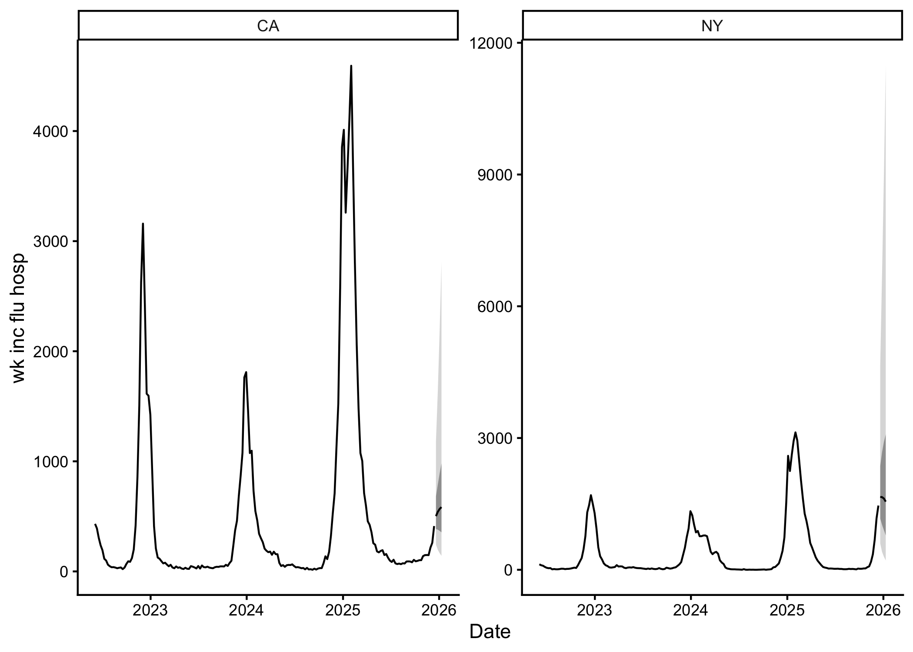

# incast

`incast` provides a complete pipeline for infectious diseases forecasts.
It fetches
([`get_data()`](https://accidda.github.io/incast/reference/get_data.md))
and validates input data
([`check_data()`](https://accidda.github.io/incast/reference/check_data.md)),
optionally applies nowcasting to adjust for reporting delays
([`get_ncast()`](https://accidda.github.io/incast/reference/get_ncast.md)),
evaluates models by cross-validation
([`get_cv()`](https://accidda.github.io/incast/reference/get_cv.md)),
and generates forecasts
([`get_fcast()`](https://accidda.github.io/incast/reference/get_fcast.md)).

## Installation

You can install the development version of incast from
[GitHub](https://github.com/) with:

``` r

# install.packages("pak")
# pak::pak("ACCIDDA/incast")
```

## Example

``` r

library(incast)
tail(example_data)
#> # A tibble: 6 × 5
#>   as_of      location target          target_end_date observation
#>   <date>     <chr>    <chr>           <date>                <dbl>
#> 1 2025-12-07 CA       wk inc flu hosp 2025-12-06              233
#> 2 2025-12-14 CA       wk inc flu hosp 2025-12-06              259
#> 3 2025-12-07 NY       wk inc flu hosp 2025-12-06             1160
#> 4 2025-12-14 NY       wk inc flu hosp 2025-12-06             1171
#> 5 2025-12-14 CA       wk inc flu hosp 2025-12-13              412
#> 6 2025-12-14 NY       wk inc flu hosp 2025-12-13             1462
```

``` r

fcast <- example_data |>
  check_data() |>
  get_ncast() |>
  get_cv(eval_start_date = as.Date("2025-01-01")) |>
  get_fcast()
#> ℹ Using max_delay = 6 from data
#> ℹ Truncating from max_delay = 6 to 2.
#> ℹ Using max_delay = 6 from data
#> ℹ Truncating from max_delay = 6 to 2.
#> [2026-07-29 18:48:06.284] get_cv: +2.7109 secs
#> [2026-07-29 18:48:09.007] get_fcast: +4.4587 secs

fcast
#> <incast_fcast>
#> Target:   wk inc flu hosp
#> Series:   2 (location)
#> Forecast: 2025-12-20 to 2026-01-10 (h = 4)
#> Models:   3 + ENSEMBLE

fcast |> autoplot()
```



Save to [myRespiLens](https://www.respilens.com/myrespilens) format:

``` r

to_respilens(fcast, path = "respilens.json")
```
